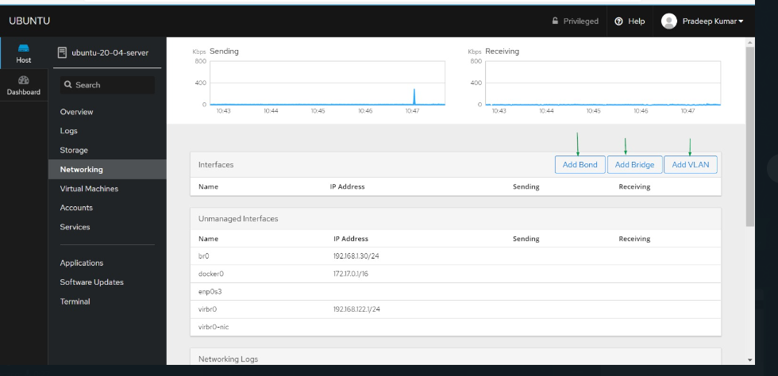

Instalar cockpit:

sudo apt install cockpit -y 

Depois teria de entrar em um endereço mas como a minha maquina não está a dar usei a maquina do meu colega para pegar uma base para o meu trabalho.

Para ativar o cokcpit : sudo systemctl enable --now cockpit.socket

no fim ficaria assim 