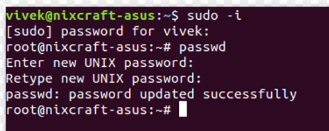

A- Criar dois utilizadores :

para aceder o servidor via ss  usei: ssh root@

Para adicionar eu usei o comando: adduser Pedro e adduser Caio

Depois foi solicitado para eu  preencher informações sobre o Pedro e do Caio

Depois adicionei o Pedro  ao grupo sudo com o seguinte comando:

usermod -aG sudo Pedro

B-Para modificar  a palavra passe eu usei o seguinte comando :

